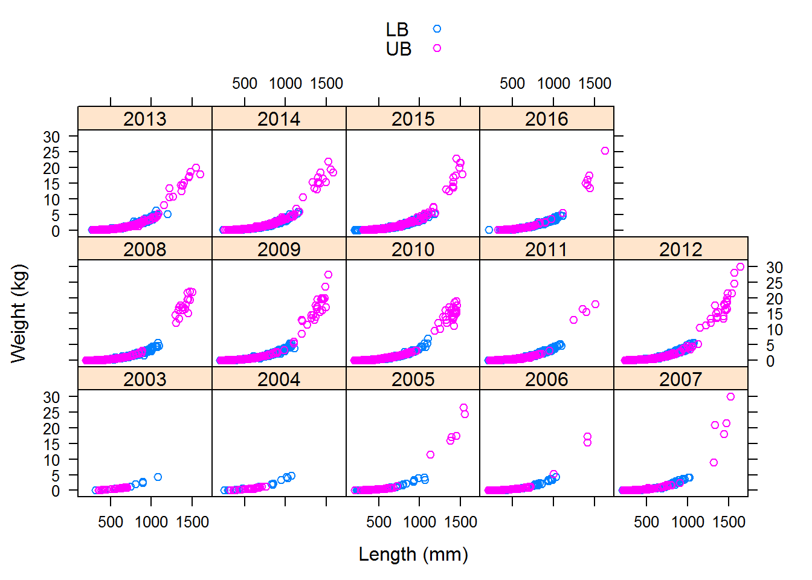
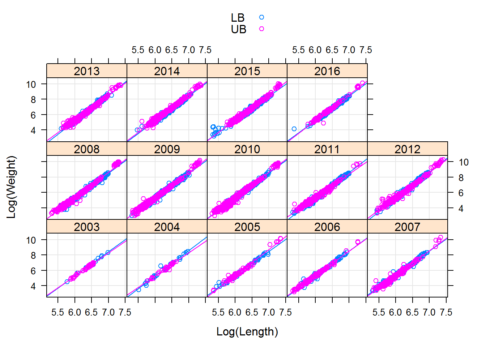
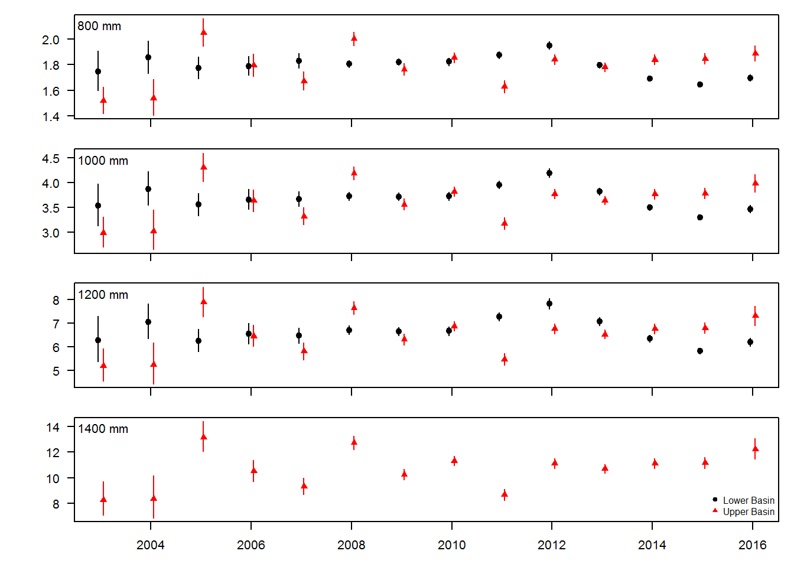

## Analysis source

Analysis source code can be viewed at [https://github.com/mcolvin/PDSG-LW](https://github.com/mcolvin/PDSG-LW).

## Length weight analysis of covariance

### Analysis overview:

This analysis fits length-weight data for pallid sturgeon captured in the upper (RPMA 2 and 3) and lower (RPMA 4) basins of
the Missouri River.  The rationale for this analysis is that condition is an index of weight given an expected weight and therefore
modelling expected weight as a function of length using the base model $log(Weight) = log(a)+b\cdot log(Length)$ will illustrate
changes in expected weight.  This approach allows evaluating how expected weight is changing over time that complements analyses of
condition. Specifically, if conditions is decreasing over time, it is reasonable to expect to see a decrease in expected fish weight
for a given length. 

### Methods in a nutshell

1. Fit length-weight data as a linear model by log transforming length and weight
2. Estimate effect of year, basin and specific interactions
3. An effect of day of year ($DOY$) and $DOY^2$ is included to account for within year differences in expected weight for a given length.  
3. NOTE-year is treated as a factor rather than continuous

### Preliminary results

1. Length-weight relationships varied among year and basin (Figure 1). 
1. The maximum length of Upper basin fish (RPMA 2, RPMA3) was larger than lower basin (RPMA 4) fish (Figure 1, Table 1). 
1. The model estimates a unique length-weight for each year basin combination on log log scale (Figure 2).
1. The model estimated an effect of $DOY$ and $DOY^2$ (Table 2) indicating some variability in expected weight for a given length
within year to account for seasonality.
1. The model fit was good, it should be. $R^2$ = 0.9878175
1. The length-weight Upper basin and lower basin fish varied among years, in some years upper basin fish were heavier for a given length
than lower basin fish, in other years lower basin fish were slightly heavier for a given length, and in other years they were similar (Figure 2).
1. One thing to keep in mind is that fish greater than 1200 mm were only observed in the upper basin.
1. The preliminary analysis suggests that expected weight for a given length has decreased since 2012 for RPMA4 fish.
1. Mean weight for a given length was lowest for RPMA4 fish in 2015 relative to estimates from 2003 to 2016
1. Upper expected weight for upper basin fish has remained constant since 2012.

### Discussion points

1. The effect of DOY was fixed among years but allowed to vary by basin. Might make sense to allow to vary among year as well? 
2. The effect of DOY is not quite what I want, it might make more sense to use it to model variability in the $b$ parameter in a
hierarchical fashion. 
3. Any thoughts on what happened in the upper basin in 2011 and in early years  (2003, 2004)?  Those fish might have been skinny. Floods?   

### Figures

Figure 1. Pallid sturgeon weight (y-axis) and length (x-axis) for 2003 to 2016 grouped by Missouri River basin (Upper; pink open circles,
lower; blue open circles).  

Figure 2. Plot of weight (y-axis) and length (x-axis) on log scale for Pallid Sturgeon captured in Missouri River
basins ((Upper; pink open circles, lower; blue open circles). 
Lines represent best fit linear models predicting weight from length for data in each panel and group.

Figure 3. Plot of condition (y-axis) and day of year (x-axis) for Pallid Sturgeon captured in the upper and lower basins.

Figure 4. Plot of estimated weight (y-axis) and year (x-axis) for varying pallid sturgeon lengths (800, 1000, 1200, and 1400 mm).
Lower basin estimates were not included for fish 1400 mm because they were not observed.
Expected weights and confidence intervals were estimated for April 1 ($DOY$ = 92).
Vertical lines denote 95% confidence intervals   .

### Tables

Table 1. Summary of length and weight by basin and year for pallid sturgeon captured in the Missouri River.  

----------------------------------------------------------------------
 basin   year_f   length.mean   length.min   length.max   weight.mean 
------- -------- ------------- ------------ ------------ -------------
  LB      2003        704          320          1080         1533     

  LB      2004        582          248          1069         1164     

  LB      2005        544          230          1068          878     

  LB      2006        552          224          1030          867     

  LB      2007        484          202          1023          597     

  LB      2008        607          267          1094          957     

  LB      2009        607          202          1108          959     

  LB      2010        568          260          1100          795     

  LB      2011        585          205          1095          959     

  LB      2012        601          229          1075          969     

  LB      2013        670          270          1197         1295     

  LB      2014        697          237          1156         1367     

  LB      2015        703          205          1180         1399     

  LB      2016        743          212          1110         1654     

  UB      2003        585          355          700           650     

  UB      2004        557          324          760           592     

  UB      2005        500          210          1550         1525     

  UB      2006        414          204          1410          557     

  UB      2007        402          207          1320          312     

  UB      2008        466          202          1501         1265     

  UB      2009        419          205          1384          423     

  UB      2010        421          202          1450          410     

  UB      2011        416          213          1395          319     

  UB      2012        456          231          1570          696     

  UB      2013        489          283          1592          730     

  UB      2014        496          252          1582          651     

  UB      2015        499          315          1504          680     

  UB      2016        618          320          1625         1602     
----------------------------------------------------------------------

Table: Table continues below

 
-------------------------
 weight.min   weight.max 
------------ ------------
     90          4250    

     32          4722    

     50          4194    

     34          4266    

     28          4154    

     45          5540    

     20          5450    

     42          7000    

     27          5136    

     30          5610    

     68          6310    

     55          5950    

     25          5188    

     64          4740    

    130          1125    

    105          1253    

     28         24500    

     25         17250    

     30          8981    

    26.5        22000    

     20         17500    

     20         17000    

     37         15500    

     28         28000    

     72         20000    

     55         18500    

    105         23000    

    120         25500    
-------------------------

Table 1. Parameter estimates for linear model relating weight to length.
Factors included in the the model are Julian day, Julian day squared, basin, and year.
Varying interactions were used to all the length-weight relationship to vary by year and basin.

--------------------------------------------------------------------------
           &nbsp;              Estimate   Std. Error   t value   Pr(>|t|) 
----------------------------- ---------- ------------ --------- ----------
       **(Intercept)**          -13.6        0.74       -18.3    4.1e-74  

          **llen**               3.15       0.114       27.7    2.95e-164 

          **jday**             -0.00053    0.000122     -4.34    1.46e-05 

         **jdaysq**            1.36e-06    3.09e-07     4.39     1.14e-05 

       **year_f2004**           -0.882      0.823       -1.07     0.284   

       **year_f2005**           0.303       0.781       0.388     0.698   

       **year_f2006**           -0.311      0.774      -0.402     0.688   

       **year_f2007**           0.309       0.754       0.41      0.682   

       **year_f2008**           -0.538       0.75      -0.718     0.473   

       **year_f2009**           -0.252      0.748      -0.337     0.736   

       **year_f2010**           -0.262      0.748       -0.35     0.726   

       **year_f2011**           -1.22       0.746       -1.64     0.102   

       **year_f2012**           -1.72       0.749       -2.3      0.0217  

       **year_f2013**           -1.49       0.749       -1.99     0.0467  

       **year_f2014**           -0.755       0.75       -1.01     0.314   

       **year_f2015**           0.153       0.748       0.205     0.838   

       **year_f2016**           -0.323       0.76      -0.425     0.671   

         **basinUB**            0.612       0.927       0.66      0.509   

      **jday:basinUB**         0.000998    0.00024      4.15     3.33e-05 

     **basinUB:jdaysq**        -2.5e-06     6e-07       -4.17    3.05e-05 

   **basinUB:year_f2004**       0.969        1.19       0.815     0.415   

   **basinUB:year_f2005**       -1.97       0.988        -2       0.046   

   **basinUB:year_f2006**       -0.385      0.971      -0.396     0.692   

   **basinUB:year_f2007**       -0.487      0.952      -0.511     0.609   

   **basinUB:year_f2008**       -1.02        0.94       -1.09     0.277   

   **basinUB:year_f2009**       -0.363      0.939      -0.387     0.699   

   **basinUB:year_f2010**       -0.896      0.937      -0.957     0.339   

   **basinUB:year_f2011**        1.57        0.94       1.67      0.0943  

   **basinUB:year_f2012**       0.694       0.939       0.739      0.46   

   **basinUB:year_f2013**        0.48       0.939       0.511     0.609   

   **basinUB:year_f2014**       -0.29        0.94      -0.308     0.758   

   **basinUB:year_f2015**       -1.19        0.94       -1.26     0.207   

   **basinUB:year_f2016**       -1.53       0.972       -1.57     0.116   

     **llen:year_f2004**        0.141       0.127       1.11      0.268   

     **llen:year_f2005**       -0.0429       0.12      -0.356     0.722   

     **llen:year_f2006**        0.0502      0.119       0.421     0.674   

     **llen:year_f2007**       -0.0391      0.116      -0.337     0.736   

     **llen:year_f2008**        0.0855      0.115       0.742     0.458   

     **llen:year_f2009**        0.0439      0.115       0.382     0.703   

     **llen:year_f2010**        0.0456      0.115       0.397     0.691   

     **llen:year_f2011**        0.193       0.115       1.69      0.0918  

     **llen:year_f2012**        0.274       0.115       2.38      0.0174  

     **llen:year_f2013**        0.227       0.115       1.97      0.0484  

     **llen:year_f2014**        0.108       0.115       0.939     0.348   

     **llen:year_f2015**       -0.0319      0.115      -0.278     0.781   

     **llen:year_f2016**        0.044       0.117       0.377     0.706   

      **llen:basinUB**          -0.123      0.144      -0.856     0.392   

 **llen:basinUB:year_f2004**    -0.152      0.186      -0.817     0.414   

 **llen:basinUB:year_f2005**    0.338       0.154       2.19      0.0284  

 **llen:basinUB:year_f2006**    0.0788      0.151       0.521     0.602   

 **llen:basinUB:year_f2007**    0.0801      0.148       0.541     0.589   

 **llen:basinUB:year_f2008**    0.189       0.146        1.3      0.195   

 **llen:basinUB:year_f2009**    0.0704      0.146       0.484     0.629   

 **llen:basinUB:year_f2010**    0.158       0.145       1.08      0.278   

 **llen:basinUB:year_f2011**    -0.236      0.146       -1.61     0.106   

 **llen:basinUB:year_f2012**   -0.0916      0.146      -0.629     0.529   

 **llen:basinUB:year_f2013**   -0.0524      0.146       -0.36     0.719   

 **llen:basinUB:year_f2014**    0.0768      0.146       0.527     0.598   

 **llen:basinUB:year_f2015**    0.216       0.146       1.48      0.139   

 **llen:basinUB:year_f2016**    0.266       0.151       1.76      0.0777  
--------------------------------------------------------------------------

