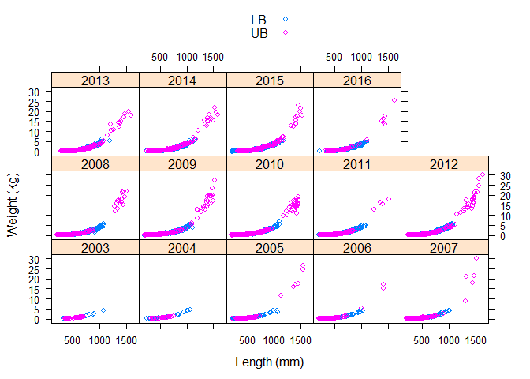
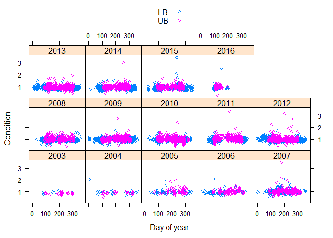
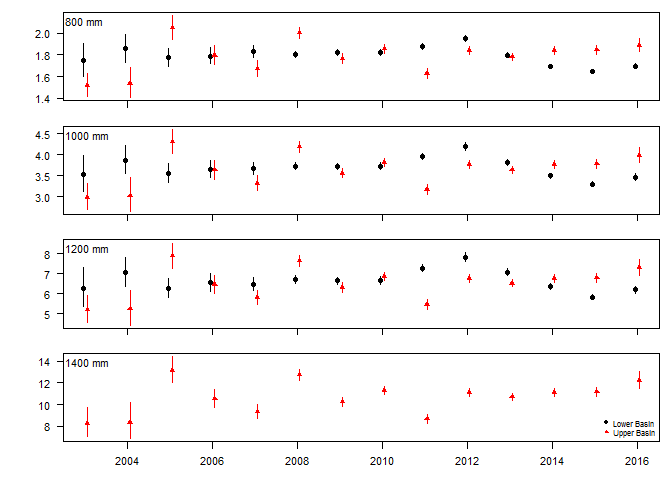
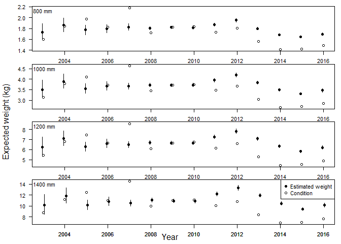
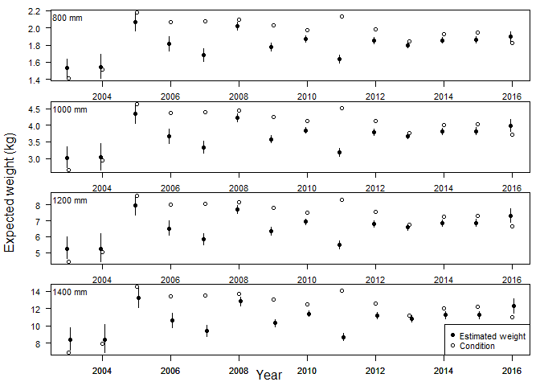
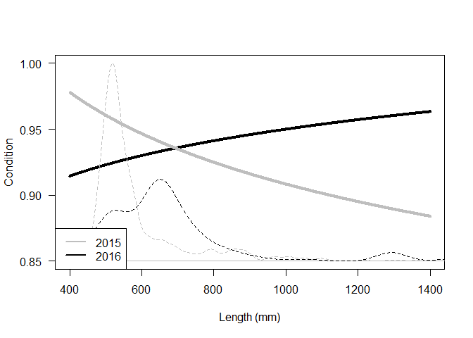
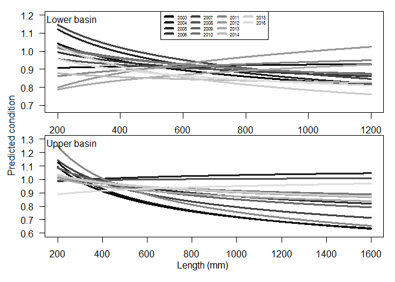

### Analysis source

Analysis source code can be viewed at <https://github.com/mcolvin/PDSG-LW>.

### Analysis overview

This analysis fits length-weight data for pallid sturgeon captured in the upper (RPMA 2 and 3) and lower (RPMA 4) basins of the Missouri River. The rationale for this analysis is that condition is an index of weight given an expected weight and therefore modelling expected weight as a function of length using the base model *l**o**g*(*W**e**i**g**h**t*)=*l**o**g*(*a*)+*b* ⋅ *l**o**g*(*L**e**n**g**t**h*) will illustrate changes in expected weight. This approach allows evaluating how expected weight is changing over time that complements analyses of condition. Specifically, if conditions is decreasing over time, it should index a decrease in expected fish weight for a given length. This analysis variant was used to answer the following questions:

1.  Does the length-weight relationship vary among years and between basins?
2.  Does mean kn correlate with predicted weights at varying sizes?
3.  If not why the discrepancy?

### Methods in a nutshell

1.  Fit length-weight data as a linear model by log transforming length and weight
2.  Estimate effect of year, basin and specific interactions
3.  Year is treated as a factor rather than continuous.
4.  Use AICc model averaging to evaluate evidence for differences among year and basins
5.  Used 'top' model to predict weights and 95% confidence intervals for 800 (i.e., reproductive fish) to 1400 mm pallid sturgeon by increments of 200.
6.  For additional analyses the 'top' model was used to predict weights 200 to 1200 or 1600 mm pallid sturgeon by increments of 1 for lower and upper basins respectively.
7.  Predicted weights were used to calculate condition for varying length fish for each basin and year combination by dividing the predicted weight by the standard weight calculated as *W**s**t**a**n**d**a**r**d* = 10( − 6.2561)⋅*L**e**n**g**t**h*3.2932

### Question 1. Does the length-weight relationship vary among years and between basins?

Short answer, yes. There is overwhelming evidence that length weight model parameters (*a* and *b*) should vary among year and basin. The AICc model selection table below provides the support.

<table>
<caption>Table continues below</caption>
<colgroup>
<col width="82%" />
<col width="6%" />
<col width="10%" />
</colgroup>
<thead>
<tr class="header">
<th align="center">model</th>
<th align="center">df</th>
<th align="center">logLik</th>
</tr>
</thead>
<tbody>
<tr class="odd">
<td align="center">~len+year+basin+llen:basin+llen:year+basin:year+len:basin:year</td>
<td align="center">57</td>
<td align="center">7986</td>
</tr>
<tr class="even">
<td align="center">~llen+llen+year+year:basin</td>
<td align="center">30</td>
<td align="center">7689</td>
</tr>
<tr class="odd">
<td align="center">~llen+year+basin+llen:year</td>
<td align="center">30</td>
<td align="center">7658</td>
</tr>
<tr class="even">
<td align="center">~year+llen+basin+llen:basin</td>
<td align="center">18</td>
<td align="center">7560</td>
</tr>
<tr class="odd">
<td align="center">~llen+year+basin</td>
<td align="center">17</td>
<td align="center">7553</td>
</tr>
<tr class="even">
<td align="center">~llen+year+llen:year</td>
<td align="center">29</td>
<td align="center">7463</td>
</tr>
<tr class="odd">
<td align="center">~len+basin+llen:basin</td>
<td align="center">5</td>
<td align="center">7359</td>
</tr>
<tr class="even">
<td align="center">~len+basin</td>
<td align="center">4</td>
<td align="center">7354</td>
</tr>
<tr class="odd">
<td align="center">~llen+year</td>
<td align="center">16</td>
<td align="center">7358</td>
</tr>
<tr class="even">
<td align="center">~length</td>
<td align="center">3</td>
<td align="center">7213</td>
</tr>
</tbody>
</table>

<table style="width:32%;">
<colgroup>
<col width="9%" />
<col width="11%" />
<col width="11%" />
</colgroup>
<thead>
<tr class="header">
<th align="center">AICc</th>
<th align="center">delta</th>
<th align="center">weight</th>
</tr>
</thead>
<tbody>
<tr class="odd">
<td align="center">-15858</td>
<td align="center">0</td>
<td align="center">1.0e+00</td>
</tr>
<tr class="even">
<td align="center">-15318</td>
<td align="center">539</td>
<td align="center">8.3e-118</td>
</tr>
<tr class="odd">
<td align="center">-15256</td>
<td align="center">602</td>
<td align="center">2.0e-131</td>
</tr>
<tr class="even">
<td align="center">-15084</td>
<td align="center">773</td>
<td align="center">1.3e-168</td>
</tr>
<tr class="odd">
<td align="center">-15072</td>
<td align="center">786</td>
<td align="center">2.4e-171</td>
</tr>
<tr class="even">
<td align="center">-14868</td>
<td align="center">989</td>
<td align="center">1.4e-215</td>
</tr>
<tr class="odd">
<td align="center">-14708</td>
<td align="center">1149</td>
<td align="center">2.8e-250</td>
</tr>
<tr class="even">
<td align="center">-14700</td>
<td align="center">1157</td>
<td align="center">5.0e-252</td>
</tr>
<tr class="odd">
<td align="center">-14684</td>
<td align="center">1174</td>
<td align="center">1.1e-255</td>
</tr>
<tr class="even">
<td align="center">-14421</td>
<td align="center">1437</td>
<td align="center">1.0e-312</td>
</tr>
</tbody>
</table>

The model selection results indicate that the length weight relationship should be viewed like the figures 1 and 2 below where there is essentially a separate length-weight relationship for each year and basin.

*Figure 1. Pallid sturgeon weight (y-axis) and length (x-axis) for 2003 to 2016 grouped by Missouri River basin (Upper; pink open circles,lower; blue open circles).*

*Figure 2. Plot of weight (y-axis) and length (x-axis) on log scale for Pallid Sturgeon captured in Missouri River basins (Upper; pink open circles, lower; blue open circles). Lines represent best fit linear models predicting weight from length for data in each panel and group.*

### Question 2. Does mean kn correlate with predicted weights at varying sizes?

Figure 3 below illustrates boxplots of condition among years and basins. Of interest to the skinny fish analysis are the years post 2011 that show a decline in condition.

*Figure 3. Plot of condition (y-axis) and day of year (x-axis) for Pallid Sturgeon captured in the upper and lower basins.*

Evaluating plots of predicted weight for a given length by year and basin in Figure 4 below we generally see a similar view as Figure 3 above.

*Figure 4. Plot of estimated weight (y-axis) and year (x-axis) for varying pallid sturgeon lengths (800, 1000, 1200, and 1400 mm). Lower basin estimates were not included for fish 1400 mm because they were not observed. Vertical lines denote 95% confidence intervals. The dotted horizontal line represents the standard weight used to calculate condition.*

It should follow that condition (averaged by year and basin) and predicted weight for a given length by year and basin should exhibit similar patterns. Figure 3 above plotted condition by year and basin, which is similar to previous analyses presented to MRRIC and the ISAP and Figure 4 illustrated how the fitted model was used to estimate the weight for a given length pallid sturgeon. Superimposing the average condition factors on the data from Figure 4 above for the lower and upper basin in Figures 5 and 6 below shows a discrepancy among some of the patterns of average condition and predicted weight at length.

*Figure 5. Estimated weight for varying length lower basin pallid sturgeon among years. Open circles denote mean condition values among years for lower basin pallid sturgeon.*

*Figure 6. Estimated weight for varying length upper basin pallid sturgeon among years. Open circles denote mean condition values among years for upper basin pallid sturgeon.*

### Question 3. If not why the discrepancy?

What is going on with the discrepancy of predicted weight and mean condition? The lower basin mean condition appears to track well with predicted weight across a range of lengths. But the last 5 years or so for the upper basin showed a different picture with predicted weight increasing but mean condition decreasing. Why is that? Looking at predicted weight for the range of lengths (200 to 1400 mm) for upper basin fish for 2015 and 2016 in Figure 7 below we see that condition varies with length and the pattern varies between the 2015 and 2016. Mean condition is that it is being driven by the bulk of the catch being smaller fish. Despite larger fish having a higher condition in 2016 the majority of those fish were below 800 mm. Contrasted with the 2015 fish where fish below 800 mm had a relatively high condition which in turn caused mean condition to be higher in 2015 relative to 2016.

*Figure 7. Estimated condition values for upper basin pallid sturgeon of varying length in 2015 and 2016. The dotted lines illustrate density of observations.*

The above condition can be problematic in terms of comparisons of condition because the length-weight relationships are not parallel for all the basin year combinations (i.e., b is equal for all combinations). Figure 8 below illustrates the predicted condition for each year and basin.

*Figure 8. Estimated condition values for lower and upper basin pallid sturgeon of varying length from 2003 to 2016. Line coloration indicates year with 2003 being greay and 2016 being black. *
