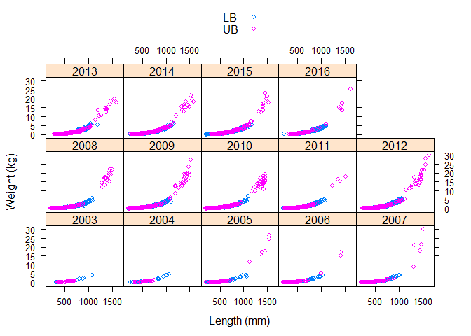

Analysis source
---------------

Analysis source code can be viewed at <https://github.com/mcolvin/PDSG-LW>.

Length weight analysis of covariance
------------------------------------

### Analysis overview:

This analysis fits length-weight data for pallid sturgeon captured in the upper (RPMA 2 and 3) and lower (RPMA 4) basins of the Missouri River. The rationale for this analysis is that condition is an index of weight given an expected weight and therefore modelling expected weight as a function of length using the base model *l**o**g*(*W**e**i**g**h**t*)=*l**o**g*(*a*)+*b* ⋅ *l**o**g*(*L**e**n**g**t**h*) will illustrate changes in expected weight. This approach allows evaluating how expected weight is changing over time that complements analyses of condition. Specifically, if conditions is decreasing over time, it is reasonable to expect to see a decrease in expected fish weight for a given length.

### Methods in a nutshell

1.  Fit length-weight data as a linear model by log transforming length and weight
2.  Estimate effect of year, basin and specific interactions
3.  An effect of day of year (*D**O**Y*) and *D**O**Y*2 is included to account for within year differences in expected weight for a given length.
4.  NOTE-year is treated as a factor rather than continuous

### Preliminary results

1.  Length-weight relationships varied among year and basin (Figure 1).
2.  The maximum length of Upper basin fish (RPMA 2, RPMA3) was larger than lower basin (RPMA 4) fish (Figure 1, Table 1).
3.  The model estimates a unique length-weight for each year basin combination on log log scale (Figure 2).
4.  The model estimated an effect of *D**O**Y* and *D**O**Y*2 (Table 2) indicating some variability in expected weight for a given length within year to account for seasonality.
5.  The model fit was good, it should be. *R*2 = 0.9878175
6.  The length-weight Upper basin and lower basin fish varied among years, in some years upper basin fish were heavier for a given length than lower basin fish, in other years lower basin fish were slightly heavier for a given length, and in other years they were similar (Figure 2).
7.  One thing to keep in mind is that fish greater than 1200 mm were only observed in the upper basin.
8.  The preliminary analysis suggests that expected weight for a given length has decreased since 2012 for RPMA4 fish.
9.  Mean weight for a given length was lowest for RPMA4 fish in 2015 relative to estimates from 2003 to 2016
10. Upper expected weight for upper basin fish has remained constant since 2012.

### Discussion points

1.  The effect of DOY was fixed among years but allowed to vary by basin. Might make sense to allow to vary among year as well?
2.  The effect of DOY is not quite what I want, it might make more sense to use it to model variability in the *b* parameter in a hierarchical fashion.
3.  Any thoughts on what happened in the upper basin in 2011 and in early years (2003, 2004)? Those fish might have been skinny. Floods?

### Figures

Figure 1. Pallid sturgeon weight (y-axis) and length (x-axis) for 2003 to 2016 grouped by Missouri River basin (Upper; pink open circles, lower; blue open circles).

Figure 2. Plot of weight (y-axis) and length (x-axis) on log scale for Pallid Sturgeon captured in Missouri River basins ((Upper; pink open circles, lower; blue open circles). Lines represent best fit linear models predicting weight from length for data in each panel and group.

Figure 3. Plot of condition (y-axis) and day of year (x-axis) for Pallid Sturgeon captured in the upper and lower basins.

Figure 4. Plot of estimated weight (y-axis) and year (x-axis) for varying pallid sturgeon lengths (800, 1000, 1200, and 1400 mm). Lower basin estimates were not included for fish 1400 mm because they were not observed. Expected weights and confidence intervals were estimated for April 1 (*D**O**Y* = 92). Vertical lines denote 95% confidence intervals .

### Tables

Table 1. Summary of length and weight by basin and year for pallid sturgeon captured in the Missouri River.

<table style="width:97%;">
<caption>Table continues below</caption>
<colgroup>
<col width="11%" />
<col width="12%" />
<col width="19%" />
<col width="18%" />
<col width="18%" />
<col width="18%" />
</colgroup>
<thead>
<tr class="header">
<th align="center">basin</th>
<th align="center">year_f</th>
<th align="center">length.mean</th>
<th align="center">length.min</th>
<th align="center">length.max</th>
<th align="center">weight.mean</th>
</tr>
</thead>
<tbody>
<tr class="odd">
<td align="center">LB</td>
<td align="center">2003</td>
<td align="center">704</td>
<td align="center">320</td>
<td align="center">1080</td>
<td align="center">1533</td>
</tr>
<tr class="even">
<td align="center">LB</td>
<td align="center">2004</td>
<td align="center">582</td>
<td align="center">248</td>
<td align="center">1069</td>
<td align="center">1164</td>
</tr>
<tr class="odd">
<td align="center">LB</td>
<td align="center">2005</td>
<td align="center">544</td>
<td align="center">230</td>
<td align="center">1068</td>
<td align="center">878</td>
</tr>
<tr class="even">
<td align="center">LB</td>
<td align="center">2006</td>
<td align="center">552</td>
<td align="center">224</td>
<td align="center">1030</td>
<td align="center">867</td>
</tr>
<tr class="odd">
<td align="center">LB</td>
<td align="center">2007</td>
<td align="center">484</td>
<td align="center">202</td>
<td align="center">1023</td>
<td align="center">597</td>
</tr>
<tr class="even">
<td align="center">LB</td>
<td align="center">2008</td>
<td align="center">607</td>
<td align="center">267</td>
<td align="center">1094</td>
<td align="center">957</td>
</tr>
<tr class="odd">
<td align="center">LB</td>
<td align="center">2009</td>
<td align="center">607</td>
<td align="center">202</td>
<td align="center">1108</td>
<td align="center">959</td>
</tr>
<tr class="even">
<td align="center">LB</td>
<td align="center">2010</td>
<td align="center">568</td>
<td align="center">260</td>
<td align="center">1100</td>
<td align="center">795</td>
</tr>
<tr class="odd">
<td align="center">LB</td>
<td align="center">2011</td>
<td align="center">585</td>
<td align="center">205</td>
<td align="center">1095</td>
<td align="center">959</td>
</tr>
<tr class="even">
<td align="center">LB</td>
<td align="center">2012</td>
<td align="center">601</td>
<td align="center">229</td>
<td align="center">1075</td>
<td align="center">969</td>
</tr>
<tr class="odd">
<td align="center">LB</td>
<td align="center">2013</td>
<td align="center">670</td>
<td align="center">270</td>
<td align="center">1197</td>
<td align="center">1295</td>
</tr>
<tr class="even">
<td align="center">LB</td>
<td align="center">2014</td>
<td align="center">697</td>
<td align="center">237</td>
<td align="center">1156</td>
<td align="center">1367</td>
</tr>
<tr class="odd">
<td align="center">LB</td>
<td align="center">2015</td>
<td align="center">703</td>
<td align="center">205</td>
<td align="center">1180</td>
<td align="center">1399</td>
</tr>
<tr class="even">
<td align="center">LB</td>
<td align="center">2016</td>
<td align="center">743</td>
<td align="center">212</td>
<td align="center">1110</td>
<td align="center">1654</td>
</tr>
<tr class="odd">
<td align="center">UB</td>
<td align="center">2003</td>
<td align="center">585</td>
<td align="center">355</td>
<td align="center">700</td>
<td align="center">650</td>
</tr>
<tr class="even">
<td align="center">UB</td>
<td align="center">2004</td>
<td align="center">557</td>
<td align="center">324</td>
<td align="center">760</td>
<td align="center">592</td>
</tr>
<tr class="odd">
<td align="center">UB</td>
<td align="center">2005</td>
<td align="center">500</td>
<td align="center">210</td>
<td align="center">1550</td>
<td align="center">1525</td>
</tr>
<tr class="even">
<td align="center">UB</td>
<td align="center">2006</td>
<td align="center">414</td>
<td align="center">204</td>
<td align="center">1410</td>
<td align="center">557</td>
</tr>
<tr class="odd">
<td align="center">UB</td>
<td align="center">2007</td>
<td align="center">402</td>
<td align="center">207</td>
<td align="center">1320</td>
<td align="center">312</td>
</tr>
<tr class="even">
<td align="center">UB</td>
<td align="center">2008</td>
<td align="center">466</td>
<td align="center">202</td>
<td align="center">1501</td>
<td align="center">1265</td>
</tr>
<tr class="odd">
<td align="center">UB</td>
<td align="center">2009</td>
<td align="center">419</td>
<td align="center">205</td>
<td align="center">1384</td>
<td align="center">423</td>
</tr>
<tr class="even">
<td align="center">UB</td>
<td align="center">2010</td>
<td align="center">421</td>
<td align="center">202</td>
<td align="center">1450</td>
<td align="center">410</td>
</tr>
<tr class="odd">
<td align="center">UB</td>
<td align="center">2011</td>
<td align="center">416</td>
<td align="center">213</td>
<td align="center">1395</td>
<td align="center">319</td>
</tr>
<tr class="even">
<td align="center">UB</td>
<td align="center">2012</td>
<td align="center">456</td>
<td align="center">231</td>
<td align="center">1570</td>
<td align="center">696</td>
</tr>
<tr class="odd">
<td align="center">UB</td>
<td align="center">2013</td>
<td align="center">489</td>
<td align="center">283</td>
<td align="center">1592</td>
<td align="center">730</td>
</tr>
<tr class="even">
<td align="center">UB</td>
<td align="center">2014</td>
<td align="center">496</td>
<td align="center">252</td>
<td align="center">1582</td>
<td align="center">651</td>
</tr>
<tr class="odd">
<td align="center">UB</td>
<td align="center">2015</td>
<td align="center">499</td>
<td align="center">315</td>
<td align="center">1504</td>
<td align="center">680</td>
</tr>
<tr class="even">
<td align="center">UB</td>
<td align="center">2016</td>
<td align="center">618</td>
<td align="center">320</td>
<td align="center">1625</td>
<td align="center">1602</td>
</tr>
</tbody>
</table>

<table style="width:36%;">
<colgroup>
<col width="18%" />
<col width="18%" />
</colgroup>
<thead>
<tr class="header">
<th align="center">weight.min</th>
<th align="center">weight.max</th>
</tr>
</thead>
<tbody>
<tr class="odd">
<td align="center">90</td>
<td align="center">4250</td>
</tr>
<tr class="even">
<td align="center">32</td>
<td align="center">4722</td>
</tr>
<tr class="odd">
<td align="center">50</td>
<td align="center">4194</td>
</tr>
<tr class="even">
<td align="center">34</td>
<td align="center">4266</td>
</tr>
<tr class="odd">
<td align="center">28</td>
<td align="center">4154</td>
</tr>
<tr class="even">
<td align="center">45</td>
<td align="center">5540</td>
</tr>
<tr class="odd">
<td align="center">20</td>
<td align="center">5450</td>
</tr>
<tr class="even">
<td align="center">42</td>
<td align="center">7000</td>
</tr>
<tr class="odd">
<td align="center">27</td>
<td align="center">5136</td>
</tr>
<tr class="even">
<td align="center">30</td>
<td align="center">5610</td>
</tr>
<tr class="odd">
<td align="center">68</td>
<td align="center">6310</td>
</tr>
<tr class="even">
<td align="center">55</td>
<td align="center">5950</td>
</tr>
<tr class="odd">
<td align="center">25</td>
<td align="center">5188</td>
</tr>
<tr class="even">
<td align="center">64</td>
<td align="center">4740</td>
</tr>
<tr class="odd">
<td align="center">130</td>
<td align="center">1125</td>
</tr>
<tr class="even">
<td align="center">105</td>
<td align="center">1253</td>
</tr>
<tr class="odd">
<td align="center">28</td>
<td align="center">24500</td>
</tr>
<tr class="even">
<td align="center">25</td>
<td align="center">17250</td>
</tr>
<tr class="odd">
<td align="center">30</td>
<td align="center">8981</td>
</tr>
<tr class="even">
<td align="center">26.5</td>
<td align="center">22000</td>
</tr>
<tr class="odd">
<td align="center">20</td>
<td align="center">17500</td>
</tr>
<tr class="even">
<td align="center">20</td>
<td align="center">17000</td>
</tr>
<tr class="odd">
<td align="center">37</td>
<td align="center">15500</td>
</tr>
<tr class="even">
<td align="center">28</td>
<td align="center">28000</td>
</tr>
<tr class="odd">
<td align="center">72</td>
<td align="center">20000</td>
</tr>
<tr class="even">
<td align="center">55</td>
<td align="center">18500</td>
</tr>
<tr class="odd">
<td align="center">105</td>
<td align="center">23000</td>
</tr>
<tr class="even">
<td align="center">120</td>
<td align="center">25500</td>
</tr>
</tbody>
</table>

Table 1. Parameter estimates for linear model relating weight to length. Factors included in the the model are Julian day, Julian day squared, basin, and year. Varying interactions were used to all the length-weight relationship to vary by year and basin.

<table>
<colgroup>
<col width="40%" />
<col width="14%" />
<col width="17%" />
<col width="13%" />
<col width="13%" />
</colgroup>
<thead>
<tr class="header">
<th align="center"> </th>
<th align="center">Estimate</th>
<th align="center">Std. Error</th>
<th align="center">t value</th>
<th align="center">Pr(&gt;|t|)</th>
</tr>
</thead>
<tbody>
<tr class="odd">
<td align="center"><strong>(Intercept)</strong></td>
<td align="center">-13.6</td>
<td align="center">0.74</td>
<td align="center">-18.3</td>
<td align="center">4.1e-74</td>
</tr>
<tr class="even">
<td align="center"><strong>llen</strong></td>
<td align="center">3.15</td>
<td align="center">0.114</td>
<td align="center">27.7</td>
<td align="center">2.95e-164</td>
</tr>
<tr class="odd">
<td align="center"><strong>jday</strong></td>
<td align="center">-0.00053</td>
<td align="center">0.000122</td>
<td align="center">-4.34</td>
<td align="center">1.46e-05</td>
</tr>
<tr class="even">
<td align="center"><strong>jdaysq</strong></td>
<td align="center">1.36e-06</td>
<td align="center">3.09e-07</td>
<td align="center">4.39</td>
<td align="center">1.14e-05</td>
</tr>
<tr class="odd">
<td align="center"><strong>year_f2004</strong></td>
<td align="center">-0.882</td>
<td align="center">0.823</td>
<td align="center">-1.07</td>
<td align="center">0.284</td>
</tr>
<tr class="even">
<td align="center"><strong>year_f2005</strong></td>
<td align="center">0.303</td>
<td align="center">0.781</td>
<td align="center">0.388</td>
<td align="center">0.698</td>
</tr>
<tr class="odd">
<td align="center"><strong>year_f2006</strong></td>
<td align="center">-0.311</td>
<td align="center">0.774</td>
<td align="center">-0.402</td>
<td align="center">0.688</td>
</tr>
<tr class="even">
<td align="center"><strong>year_f2007</strong></td>
<td align="center">0.309</td>
<td align="center">0.754</td>
<td align="center">0.41</td>
<td align="center">0.682</td>
</tr>
<tr class="odd">
<td align="center"><strong>year_f2008</strong></td>
<td align="center">-0.538</td>
<td align="center">0.75</td>
<td align="center">-0.718</td>
<td align="center">0.473</td>
</tr>
<tr class="even">
<td align="center"><strong>year_f2009</strong></td>
<td align="center">-0.252</td>
<td align="center">0.748</td>
<td align="center">-0.337</td>
<td align="center">0.736</td>
</tr>
<tr class="odd">
<td align="center"><strong>year_f2010</strong></td>
<td align="center">-0.262</td>
<td align="center">0.748</td>
<td align="center">-0.35</td>
<td align="center">0.726</td>
</tr>
<tr class="even">
<td align="center"><strong>year_f2011</strong></td>
<td align="center">-1.22</td>
<td align="center">0.746</td>
<td align="center">-1.64</td>
<td align="center">0.102</td>
</tr>
<tr class="odd">
<td align="center"><strong>year_f2012</strong></td>
<td align="center">-1.72</td>
<td align="center">0.749</td>
<td align="center">-2.3</td>
<td align="center">0.0217</td>
</tr>
<tr class="even">
<td align="center"><strong>year_f2013</strong></td>
<td align="center">-1.49</td>
<td align="center">0.749</td>
<td align="center">-1.99</td>
<td align="center">0.0467</td>
</tr>
<tr class="odd">
<td align="center"><strong>year_f2014</strong></td>
<td align="center">-0.755</td>
<td align="center">0.75</td>
<td align="center">-1.01</td>
<td align="center">0.314</td>
</tr>
<tr class="even">
<td align="center"><strong>year_f2015</strong></td>
<td align="center">0.153</td>
<td align="center">0.748</td>
<td align="center">0.205</td>
<td align="center">0.838</td>
</tr>
<tr class="odd">
<td align="center"><strong>year_f2016</strong></td>
<td align="center">-0.323</td>
<td align="center">0.76</td>
<td align="center">-0.425</td>
<td align="center">0.671</td>
</tr>
<tr class="even">
<td align="center"><strong>basinUB</strong></td>
<td align="center">0.612</td>
<td align="center">0.927</td>
<td align="center">0.66</td>
<td align="center">0.509</td>
</tr>
<tr class="odd">
<td align="center"><strong>jday:basinUB</strong></td>
<td align="center">0.000998</td>
<td align="center">0.00024</td>
<td align="center">4.15</td>
<td align="center">3.33e-05</td>
</tr>
<tr class="even">
<td align="center"><strong>basinUB:jdaysq</strong></td>
<td align="center">-2.5e-06</td>
<td align="center">6e-07</td>
<td align="center">-4.17</td>
<td align="center">3.05e-05</td>
</tr>
<tr class="odd">
<td align="center"><strong>basinUB:year_f2004</strong></td>
<td align="center">0.969</td>
<td align="center">1.19</td>
<td align="center">0.815</td>
<td align="center">0.415</td>
</tr>
<tr class="even">
<td align="center"><strong>basinUB:year_f2005</strong></td>
<td align="center">-1.97</td>
<td align="center">0.988</td>
<td align="center">-2</td>
<td align="center">0.046</td>
</tr>
<tr class="odd">
<td align="center"><strong>basinUB:year_f2006</strong></td>
<td align="center">-0.385</td>
<td align="center">0.971</td>
<td align="center">-0.396</td>
<td align="center">0.692</td>
</tr>
<tr class="even">
<td align="center"><strong>basinUB:year_f2007</strong></td>
<td align="center">-0.487</td>
<td align="center">0.952</td>
<td align="center">-0.511</td>
<td align="center">0.609</td>
</tr>
<tr class="odd">
<td align="center"><strong>basinUB:year_f2008</strong></td>
<td align="center">-1.02</td>
<td align="center">0.94</td>
<td align="center">-1.09</td>
<td align="center">0.277</td>
</tr>
<tr class="even">
<td align="center"><strong>basinUB:year_f2009</strong></td>
<td align="center">-0.363</td>
<td align="center">0.939</td>
<td align="center">-0.387</td>
<td align="center">0.699</td>
</tr>
<tr class="odd">
<td align="center"><strong>basinUB:year_f2010</strong></td>
<td align="center">-0.896</td>
<td align="center">0.937</td>
<td align="center">-0.957</td>
<td align="center">0.339</td>
</tr>
<tr class="even">
<td align="center"><strong>basinUB:year_f2011</strong></td>
<td align="center">1.57</td>
<td align="center">0.94</td>
<td align="center">1.67</td>
<td align="center">0.0943</td>
</tr>
<tr class="odd">
<td align="center"><strong>basinUB:year_f2012</strong></td>
<td align="center">0.694</td>
<td align="center">0.939</td>
<td align="center">0.739</td>
<td align="center">0.46</td>
</tr>
<tr class="even">
<td align="center"><strong>basinUB:year_f2013</strong></td>
<td align="center">0.48</td>
<td align="center">0.939</td>
<td align="center">0.511</td>
<td align="center">0.609</td>
</tr>
<tr class="odd">
<td align="center"><strong>basinUB:year_f2014</strong></td>
<td align="center">-0.29</td>
<td align="center">0.94</td>
<td align="center">-0.308</td>
<td align="center">0.758</td>
</tr>
<tr class="even">
<td align="center"><strong>basinUB:year_f2015</strong></td>
<td align="center">-1.19</td>
<td align="center">0.94</td>
<td align="center">-1.26</td>
<td align="center">0.207</td>
</tr>
<tr class="odd">
<td align="center"><strong>basinUB:year_f2016</strong></td>
<td align="center">-1.53</td>
<td align="center">0.972</td>
<td align="center">-1.57</td>
<td align="center">0.116</td>
</tr>
<tr class="even">
<td align="center"><strong>llen:year_f2004</strong></td>
<td align="center">0.141</td>
<td align="center">0.127</td>
<td align="center">1.11</td>
<td align="center">0.268</td>
</tr>
<tr class="odd">
<td align="center"><strong>llen:year_f2005</strong></td>
<td align="center">-0.0429</td>
<td align="center">0.12</td>
<td align="center">-0.356</td>
<td align="center">0.722</td>
</tr>
<tr class="even">
<td align="center"><strong>llen:year_f2006</strong></td>
<td align="center">0.0502</td>
<td align="center">0.119</td>
<td align="center">0.421</td>
<td align="center">0.674</td>
</tr>
<tr class="odd">
<td align="center"><strong>llen:year_f2007</strong></td>
<td align="center">-0.0391</td>
<td align="center">0.116</td>
<td align="center">-0.337</td>
<td align="center">0.736</td>
</tr>
<tr class="even">
<td align="center"><strong>llen:year_f2008</strong></td>
<td align="center">0.0855</td>
<td align="center">0.115</td>
<td align="center">0.742</td>
<td align="center">0.458</td>
</tr>
<tr class="odd">
<td align="center"><strong>llen:year_f2009</strong></td>
<td align="center">0.0439</td>
<td align="center">0.115</td>
<td align="center">0.382</td>
<td align="center">0.703</td>
</tr>
<tr class="even">
<td align="center"><strong>llen:year_f2010</strong></td>
<td align="center">0.0456</td>
<td align="center">0.115</td>
<td align="center">0.397</td>
<td align="center">0.691</td>
</tr>
<tr class="odd">
<td align="center"><strong>llen:year_f2011</strong></td>
<td align="center">0.193</td>
<td align="center">0.115</td>
<td align="center">1.69</td>
<td align="center">0.0918</td>
</tr>
<tr class="even">
<td align="center"><strong>llen:year_f2012</strong></td>
<td align="center">0.274</td>
<td align="center">0.115</td>
<td align="center">2.38</td>
<td align="center">0.0174</td>
</tr>
<tr class="odd">
<td align="center"><strong>llen:year_f2013</strong></td>
<td align="center">0.227</td>
<td align="center">0.115</td>
<td align="center">1.97</td>
<td align="center">0.0484</td>
</tr>
<tr class="even">
<td align="center"><strong>llen:year_f2014</strong></td>
<td align="center">0.108</td>
<td align="center">0.115</td>
<td align="center">0.939</td>
<td align="center">0.348</td>
</tr>
<tr class="odd">
<td align="center"><strong>llen:year_f2015</strong></td>
<td align="center">-0.0319</td>
<td align="center">0.115</td>
<td align="center">-0.278</td>
<td align="center">0.781</td>
</tr>
<tr class="even">
<td align="center"><strong>llen:year_f2016</strong></td>
<td align="center">0.044</td>
<td align="center">0.117</td>
<td align="center">0.377</td>
<td align="center">0.706</td>
</tr>
<tr class="odd">
<td align="center"><strong>llen:basinUB</strong></td>
<td align="center">-0.123</td>
<td align="center">0.144</td>
<td align="center">-0.856</td>
<td align="center">0.392</td>
</tr>
<tr class="even">
<td align="center"><strong>llen:basinUB:year_f2004</strong></td>
<td align="center">-0.152</td>
<td align="center">0.186</td>
<td align="center">-0.817</td>
<td align="center">0.414</td>
</tr>
<tr class="odd">
<td align="center"><strong>llen:basinUB:year_f2005</strong></td>
<td align="center">0.338</td>
<td align="center">0.154</td>
<td align="center">2.19</td>
<td align="center">0.0284</td>
</tr>
<tr class="even">
<td align="center"><strong>llen:basinUB:year_f2006</strong></td>
<td align="center">0.0788</td>
<td align="center">0.151</td>
<td align="center">0.521</td>
<td align="center">0.602</td>
</tr>
<tr class="odd">
<td align="center"><strong>llen:basinUB:year_f2007</strong></td>
<td align="center">0.0801</td>
<td align="center">0.148</td>
<td align="center">0.541</td>
<td align="center">0.589</td>
</tr>
<tr class="even">
<td align="center"><strong>llen:basinUB:year_f2008</strong></td>
<td align="center">0.189</td>
<td align="center">0.146</td>
<td align="center">1.3</td>
<td align="center">0.195</td>
</tr>
<tr class="odd">
<td align="center"><strong>llen:basinUB:year_f2009</strong></td>
<td align="center">0.0704</td>
<td align="center">0.146</td>
<td align="center">0.484</td>
<td align="center">0.629</td>
</tr>
<tr class="even">
<td align="center"><strong>llen:basinUB:year_f2010</strong></td>
<td align="center">0.158</td>
<td align="center">0.145</td>
<td align="center">1.08</td>
<td align="center">0.278</td>
</tr>
<tr class="odd">
<td align="center"><strong>llen:basinUB:year_f2011</strong></td>
<td align="center">-0.236</td>
<td align="center">0.146</td>
<td align="center">-1.61</td>
<td align="center">0.106</td>
</tr>
<tr class="even">
<td align="center"><strong>llen:basinUB:year_f2012</strong></td>
<td align="center">-0.0916</td>
<td align="center">0.146</td>
<td align="center">-0.629</td>
<td align="center">0.529</td>
</tr>
<tr class="odd">
<td align="center"><strong>llen:basinUB:year_f2013</strong></td>
<td align="center">-0.0524</td>
<td align="center">0.146</td>
<td align="center">-0.36</td>
<td align="center">0.719</td>
</tr>
<tr class="even">
<td align="center"><strong>llen:basinUB:year_f2014</strong></td>
<td align="center">0.0768</td>
<td align="center">0.146</td>
<td align="center">0.527</td>
<td align="center">0.598</td>
</tr>
<tr class="odd">
<td align="center"><strong>llen:basinUB:year_f2015</strong></td>
<td align="center">0.216</td>
<td align="center">0.146</td>
<td align="center">1.48</td>
<td align="center">0.139</td>
</tr>
<tr class="even">
<td align="center"><strong>llen:basinUB:year_f2016</strong></td>
<td align="center">0.266</td>
<td align="center">0.151</td>
<td align="center">1.76</td>
<td align="center">0.0777</td>
</tr>
</tbody>
</table>
